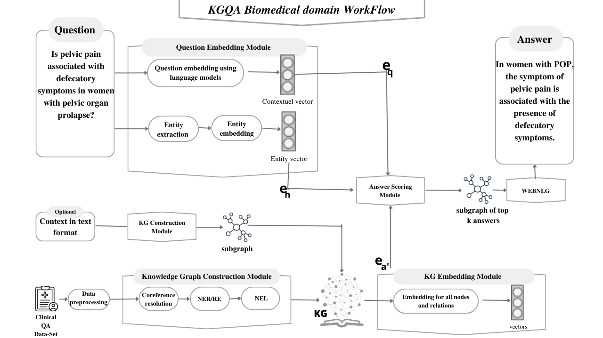

# Knowledge-graph-representation-learning-and-NLP-for-concept-based-Biomedical-Question-Answering
 ##  Contributors
 1) OULDBOUYA Ziad
 2) MOURCHID Mohcine 
 
 # Supervisor
 Fahd Kalloubi

 ## Abstract
on a ce projet "Knowledge graph representation learning and NLP for concept-based Biomedical Question/Answering" et je veux les étapes de production de ce projet
 ## Workflow

## Processing

    - Data collection PubMed and Hetionet
    - Coreference resolution
    - Name Entity Recognition
    - Relation extraction
    - Name Entity Linking
    - Knowledge Graph Construction
    - Knowledge Graph Embedding
    - Question Embedding module
    - Answer scoring module
    - Text generation
